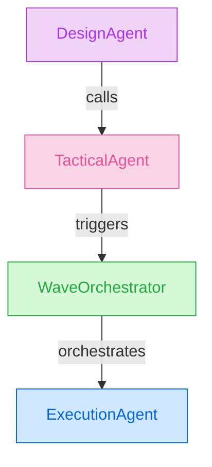
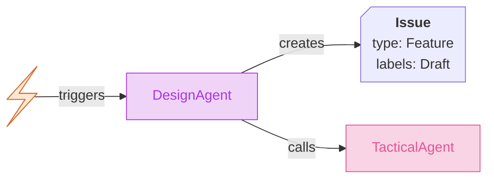
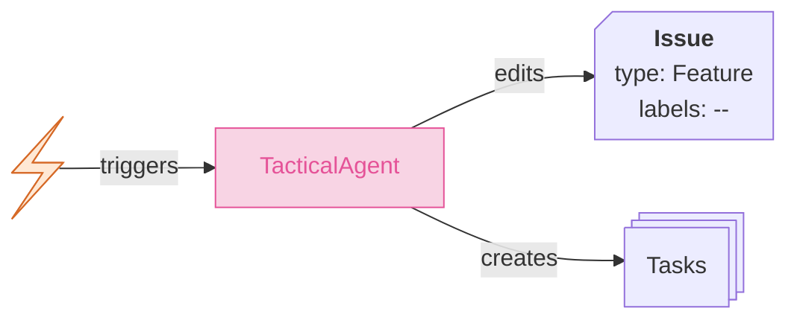
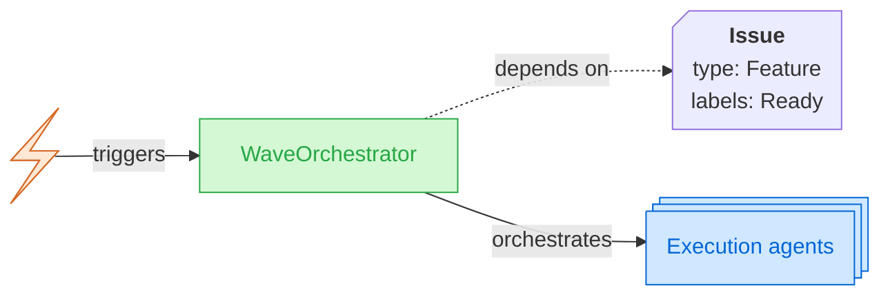
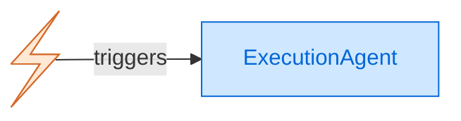

# Agents Architecture

This document is the canonical reference for the autoducks agent architecture: layers, behaviors, branching, provider abstractions, shared functions, and directory layout.

---

## Agent Layers

autoducks uses four agent layers, ordered from high-level planning to low-level execution. Each layer can trigger the next.



---

### Design Agent



**Command verb:** `design`

#### Triggers

- **Issue assignment**: agent `@design` + label `Draft` on an issue
- **Issue comment**: slash command `/agents design`

#### Behavior

<!--
designAgent.sh

Arguments:
- issueId
- issueTitle
- issueDescription
- issueComments
- issueMetadata (labels, author, etc.)

Permissions:
- read/write access to issues
- permission to edit issue descriptions and labels
- permission to set issue type
- author information
-->

<!-- EXECUTION -->
1. **[AGENT]** Creates the full issue specification (design/architecture) and edits the issue description. <!-- llm::designSpecification(issueId, issueTitle, issueDescription, issueComments, issueMetadata) + its::editIssueDescription(issueId, specification) -->
<!-- POST EXECUTION -->
2. Assigns the `Feature` type to the issue. <!-- its::setIssueType(issueId, "Feature") -->
3. Removes the `Draft` label from the issue. <!-- its::removeLabel(issueId, "Draft") -->
4. Runs the Tactical agent to create the tactical plan and dependent tasks. <!-- invokeTacticalAgent(issueId) -->

---

### Tactical Agent



**Command verb:** `devise`

#### Triggers

- **Issue assignment**: agent `@tactical` + issue type `Feature` + issue labels don't include `Draft` or `Ready`
- **Issue comment**: slash command `/agents devise`
- **Issue comment**: slash command `/agents execute` + issue type `Feature` + issue labels don't include `Draft` or `Ready` (opt-out available via config file)

#### Behavior

<!--
tacticalAgent.sh

Arguments:
- featureIssueId
- featureIssueTitle
- featureIssueDescription
- featureIssueComments
- featureIssueMetadata (labels, author, etc.)

Permissions:
- read/write access to the repository
- read/write access to issues and PRs
- permission to create branches and pull requests
- permission to create issues (child tasks)
- author information
-->

<!-- EXECUTION -->
1. **[AGENT]** Creates the tactical plan, editing the issue and creating the dependent tasks. <!-- llm::deviseTacticalPlan(featureIssueId, featureIssueTitle, featureIssueDescription, featureIssueComments, featureIssueMetadata) -->
<!-- POST EXECUTION -->
2. Each dependent task is created with the `Task` type and associated with the parent issue. <!-- its::createChildIssue(featureIssueId, taskTitle, taskDescription, taskType="Task") -->
3. The `Ready` label is added to the issue. <!-- its::addLabel(featureIssueId, "Ready") -->
4. A slug is generated: `feature/<issue_id>-<slugified_title>`. <!-- generateSlug(featureIssueId, featureIssueTitle) -->
5. A branch is created from `main` named `feature/<issue_id>-<slugified_title>`. <!-- git::createBranch("main", featureSlug) -->
6. A pull request is created from the feature branch into `main`, titled `Feature <issue_id>: <issue_title>`. <!-- its::createPullRequest(featureBranch, "main", prTitle) -->
7. The PR is linked to the parent issue. <!-- its::linkPRToIssue(prId, featureIssueId) -->
8. A comment on the issue mentions the feature author, suggesting work can begin with `/agents execute` or by assigning the PR to the agents. <!-- its::commentIssue(featureIssueId, featureAuthor, message) -->

---

### Wave Orchestrator



**Command verb:** `execute` (on a Feature issue with `Ready` label)

#### Triggers

- **Issue comment**: slash command `/agents execute` + issue type `Feature` + label `Ready`
- **PR assignment**: agent `@execution` + association to an issue of type `Feature` + label `Ready`

#### Behavior

<!--
waveOrchestrator.sh

Arguments:
- featureIssueId

Permissions:
- read access to issues
- read/write access to PRs
- permission to trigger workflow dispatches
- author information
-->

1. Get the parent feature issue and its dependent tasks. <!-- its::getIssue(featureIssueId) + its::listChildIssues(featureIssueId) -->
2. Filter tasks that are not yet completed (no merged PR). <!-- filterPendingTasks(childIssues) -->
3. Group tasks into execution waves based on dependency order or labels. <!-- groupTasksIntoWaves(pendingTasks) -->
4. For each wave, dispatch execution agents in parallel for each task. <!-- dispatchExecutionAgents(wave, featureIssueId) -->
5. Wait for all execution agents in the current wave to complete before starting the next wave. <!-- awaitWaveCompletion(waveId) -->
6. After all waves are complete, comment on the feature issue with a summary. <!-- its::commentIssue(featureIssueId, summary) -->

---

### Execution Agent



**Command verb:** `execute` (on a non-Feature issue)

#### Triggers

- **Issue assignment**: agent `@execution`
- **Issue comment**: slash command `/agents execute` + issue type is not `Feature`

#### Behavior

The Execution Agent has two scenarios depending on whether the task has a parent feature issue.

<details>
<summary><strong>Scenario A: Orphan task (no parent issue) -- PR to <code>main</code>, human review</strong></summary>

<!--
executionAgent_taskOrphan.sh

Arguments:
- taskId
- taskTitle
- taskDescription
- taskComments
- taskMetadata (labels, author, etc.)

Permissions:
- read/write access to the repository
- read/write access to issues and PRs
- permission to create branches and pull requests
- author information
-->

<!-- PRE EXECUTION -->
1. A slug is generated: `<task_id>-<slugified_title>`. <!-- generateSlug(taskId, taskTitle) -->
2. A branch is created from `main` named `feature/<task_id>-<slugified_title>`. <!-- git::createBranch("main", slug) -->
3. A pull request is created from the branch, titled `Task <task_id>: <taskTitle>`. <!-- its::createPullRequest(branch, "main", prTitle) -->
<!-- EXECUTION -->
4. The agent executes the task. <!-- llm::executeTask(taskId, taskTitle, taskDescription, taskComments, taskMetadata) -->
<!-- POST EXECUTION -->
5. A comment on the PR mentions the task author/requester and assigns the PR to them for **human review**. No auto-merge. <!-- its::commentPR(prId, taskAuthor) + its::assignPR(prId, taskAuthor) -->
</details>

<details>
<summary><strong>Scenario B: Task with parent feature -- PR to <code>feature</code> branch, auto-merge</strong></summary>

<!--
executionAgent_taskFeature.sh

Arguments:
- taskId
- taskTitle
- taskDescription
- taskComments
- taskMetadata (labels, author, etc.)
- parentIssueId

Permissions:
- read/write access to the repository
- read/write access to issues and PRs
- permission to create branches and pull requests
- author information
- merge permissions (auto-merge PR)
-->

<!-- PRE EXECUTION -->
1. Get the parent issue information (title, labels, etc.). <!-- its::getIssue(parentIssueId) -->
2. Generate a slug for the task: `<task_id>-<slugified_task_title>`. <!-- generateSlug(taskId, taskTitle) -->
3. Generate a slug for the feature: `<feature_id>-<slugified_feature_title>`. <!-- generateSlug(featureId, featureTitle) -->
4. If the parent issue does not have an associated branch, create one from `main` named `feature/<feature_id>-<slugified_feature_title>` and create its PR. <!-- git::createBranch("main", featureSlug) + its::createPullRequest(featureBranch, "main", prTitle) -->
5. Create a branch from the feature branch named `feature/<feature_id>-<slugified_feature_title>/task/<task_id>-<task_slug>`. <!-- git::createBranch(featureBranch, taskSlug) -->
6. Create a pull request from the task branch into the feature branch, titled `Task <task_id>: <task_title>`. <!-- its::createPullRequest(taskBranch, featureBranch, prTitle) -->
<!-- EXECUTION -->
7. The agent executes the task. <!-- llm::executeTask(taskId, taskTitle, taskDescription, taskComments, taskMetadata) -->
<!-- POST EXECUTION -->
8. The task PR is **auto-merged** (only CI checks run, no code review) and the branch is deleted by policy. <!-- its::mergePR(prId) -->
</details>

> **Auto-merge policy:** Auto-merge is imperative for Scenario B only, where task PRs merge into a feature branch that will itself undergo human review before reaching `main`. Scenario A PRs target `main` directly and require human review.

---

## Utility Agents

Utility agents handle recovery, cleanup, and lifecycle operations. They are not part of the main planning-to-execution pipeline.

### Fix Agent

**Command verb:** `fix`

**Trigger:** `/agents fix` on a PR with failing CI checks.

**Behavior:** Reads CI failure logs, diagnoses the issue, pushes a fix commit to the same branch, and comments on the PR with what was changed.

### Revert Agent

**Command verb:** `revert`

**Trigger:** `/agents revert` on a PR or issue.

**Behavior:** Creates a revert PR for the specified merge commit, links it to the original issue, and requests human review.

### Close Agent

**Command verb:** `close`

**Trigger:** `/agents close` on an issue or PR.

**Behavior:** Closes the issue or PR with a summary comment. If the issue is a Feature with child tasks, closes all open child tasks and their associated PRs. Cleans up branches that are no longer needed.

---

## Provider Abstraction

autoducks is designed to be platform-agnostic. All external interactions go through three provider interfaces:

| Provider | Prefix | Responsibility | Default implementation |
|----------|--------|----------------|----------------------|
| **ITS** (Issue Tracking System) | `its::` | Issues, PRs, labels, comments, assignments | GitHub (via `gh` CLI) |
| **Git** | `git::` | Branches, commits, merges, repository operations | Git CLI |
| **LLM** | `llm::` | Agent reasoning, plan generation, code writing | Claude Code |

Each provider exposes a set of functions behind a stable interface. Swapping providers (e.g., GitHub to GitLab, or Claude to another LLM) requires implementing the same function signatures without changing agent logic.

Functions in the agent scripts use the `provider::function()` calling convention documented in the HTML comments throughout this document.

---

## Shared Functions

The 17 core functions used across agents, grouped by category.

### Feedback

| # | Function | Description |
|---|----------|-------------|
| 1 | `its::commentIssue(issueId, message)` | Post a comment on an issue |
| 2 | `its::commentPR(prId, message)` | Post a comment on a pull request |
| 3 | `its::assignPR(prId, userId)` | Assign a user to a pull request |

### ITS Operations

| # | Function | Description |
|---|----------|-------------|
| 4 | `its::getIssue(issueId)` | Fetch issue details (title, body, labels, type) |
| 5 | `its::listChildIssues(issueId)` | List child/dependent issues of a parent |
| 6 | `its::createChildIssue(parentId, title, body, type)` | Create a child issue linked to a parent |
| 7 | `its::editIssueDescription(issueId, body)` | Replace an issue's description |
| 8 | `its::setIssueType(issueId, type)` | Set the issue type (Feature, Task, etc.) |
| 9 | `its::addLabel(issueId, label)` | Add a label to an issue |
| 10 | `its::removeLabel(issueId, label)` | Remove a label from an issue |
| 11 | `its::createPullRequest(head, base, title)` | Create a pull request |
| 12 | `its::linkPRToIssue(prId, issueId)` | Associate a PR with an issue |
| 13 | `its::mergePR(prId)` | Merge a pull request (auto-merge) |

### Git Operations

| # | Function | Description |
|---|----------|-------------|
| 14 | `git::createBranch(base, name)` | Create a branch from a base ref |

### Orchestration

| # | Function | Description |
|---|----------|-------------|
| 15 | `generateSlug(id, title)` | Generate a URL-safe slug from id + title |
| 16 | `filterPendingTasks(issues)` | Filter issues to those without a merged PR |
| 17 | `groupTasksIntoWaves(tasks)` | Partition tasks into sequential execution waves |

---

## Branch Naming

All branches follow a predictable convention rooted in issue IDs.

| Context | Pattern | Example |
|---------|---------|---------|
| Feature | `feature/<number>-<slug>` | `feature/42-user-auth` |
| Task under feature | `feature/<number>-<slug>/task/<task_number>-<task_slug>` | `feature/42-user-auth/task/43-login-form` |
| Orphan task | `feature/<number>-<slug>` | `feature/99-fix-typo` |

---

## Labels

| Label | Meaning |
|-------|---------|
| `Draft` | Issue needs design work before tactical planning |
| `Ready` | Tactical plan is complete; issue is ready for execution |
| `type=Feature` | Issue represents a feature (set via issue type, not label where supported) |

---

## Directory Structure

```
.autoducks/
  config.yml              # Project-level configuration (opt-outs, defaults)
  design/
    AGENTS.md             # This document -- canonical agent architecture reference
  agents/
    design.md             # Design agent prompt / CLAUDE.md
    tactical.md           # Tactical agent prompt / CLAUDE.md
    wave.md               # Wave orchestrator prompt / CLAUDE.md
    execution.md          # Execution agent prompt / CLAUDE.md
    fix.md                # Fix agent prompt / CLAUDE.md
    revert.md             # Revert agent prompt / CLAUDE.md
    close.md              # Close agent prompt / CLAUDE.md
  providers/
    its/                  # ITS provider implementations
    git/                  # Git provider implementations
    llm/                  # LLM provider implementations
  shared/
    functions/            # Shared function implementations (slugify, wave grouping, etc.)
  workflows/              # CI/CD workflow templates (GitHub Actions, etc.)
```
